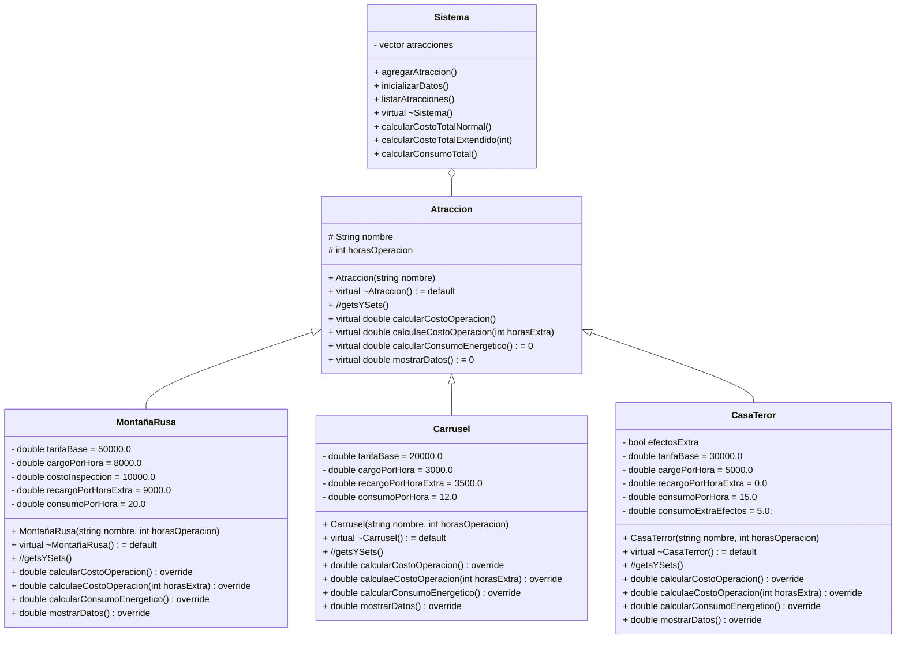

```mermaid
classDiagram


class Sistema{

   - vector<Atraccion *> atracciones

   
    
   + agregarAtraccion()
   + inicializarDatos()
   + listarAtracciones()

   + virtual ~Sistema()

   + calcularCostoTotalNormal()
   + calcularCostoTotalExtendido(int)
   + calcularConsumoTotal()
    
}

Sistema o--Atraccion

class Atraccion{

# String nombre
# int horasOperacion


+ Atraccion (string nombre)
+ virtual ~Atraccion() = default
+ //getsYSets()

+ virtual double calcularCostoOperacion()
+ virtual double calculaeCostoOperacion( int horasExtra)
+ virtual double calcularConsumoEnergetico() = 0
+ virtual double mostrarDatos() = 0

}

class MontañaRusa{

     - double tarifaBase = 50000.0
     - double cargoPorHora = 8000.0
     - double costoInspeccion = 10000.0
     - double recargoPorHoraExtra = 9000.0
     - double consumoPorHora = 20.0

     + MontañaRusa(string nombre, int horasOperacion)
     + virtual ~MontañaRusa() = default
     + //getsYSets()

     + double calcularCostoOperacion() override
     + double calculaeCostoOperacion( int horasExtra) override
     + double calcularConsumoEnergetico() override
     + double mostrarDatos() override
    
    
}

class Carrusel{

    
     - double tarifaBase = 20000.0
     - double cargoPorHora = 3000.0
     - double recargoPorHoraExtra = 3500.0
     - double consumoPorHora = 12.0
     
     + Carrusel(string nombre, int horasOperacion)
     + virtual ~Carrusel() = default
     + //getsYSets()

     + double calcularCostoOperacion() override
     + double calculaeCostoOperacion( int horasExtra) override
     + double calcularConsumoEnergetico() override
     + double mostrarDatos() override
   
}


class CasaTeror{

     - bool efectosExtra
    
     - double tarifaBase = 30000.0
     - double cargoPorHora = 5000.0
     - double recargoPorHoraExtra = 0.0
     - double consumoPorHora = 15.0
     - double consumoExtraEfectos = 5.0;

     + CasaTerror(string nombre, int horasOperacion)
     + virtual ~CasaTerror() = default
     + //getsYSets()

     + double calcularCostoOperacion() override
     + double calculaeCostoOperacion( int horasExtra) override
     + double calcularConsumoEnergetico() override
     + double mostrarDatos() override

    
}

Atraccion <|--MontañaRusa
Atraccion <|--Carrusel
Atraccion <|--CasaTeror


```

